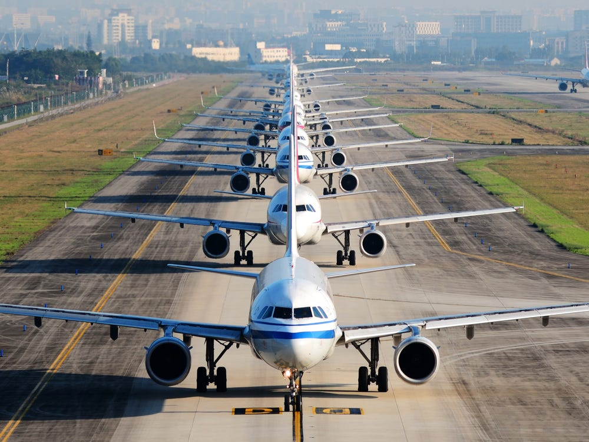
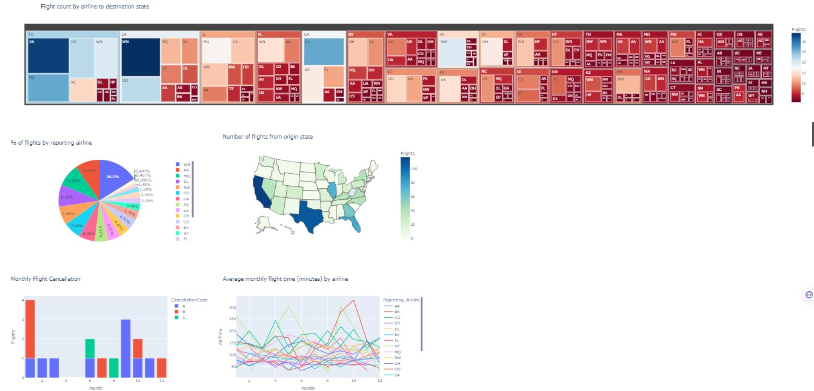
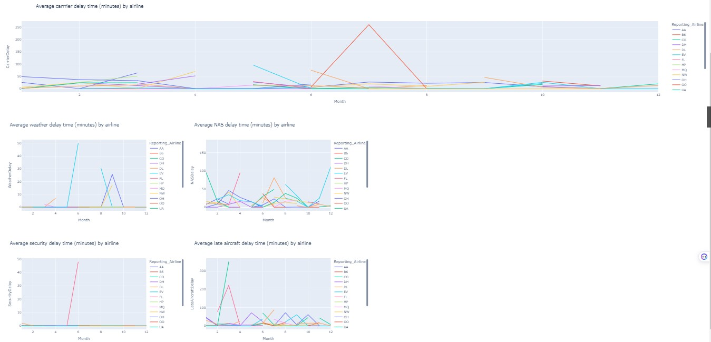
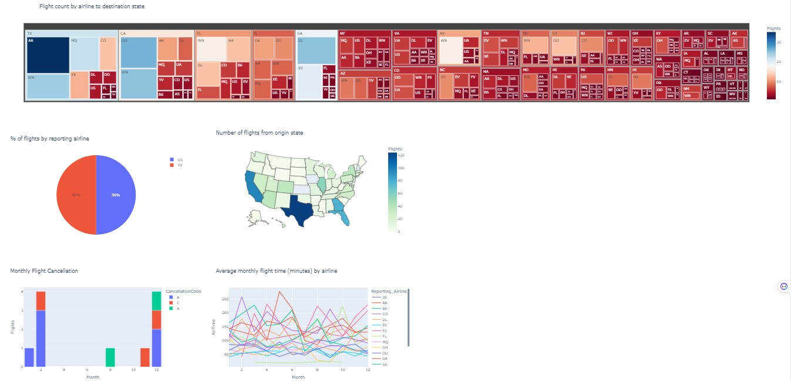
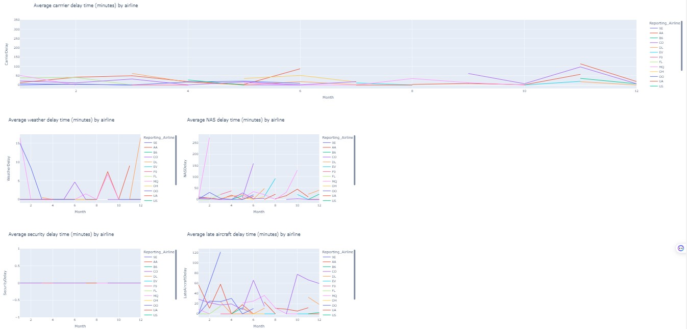
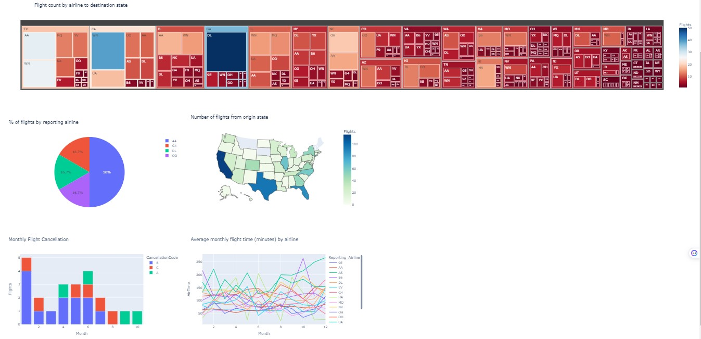
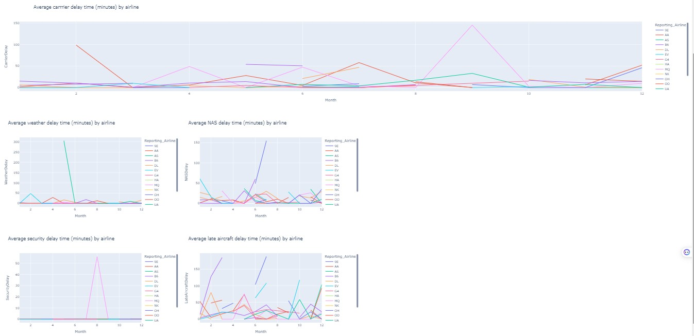
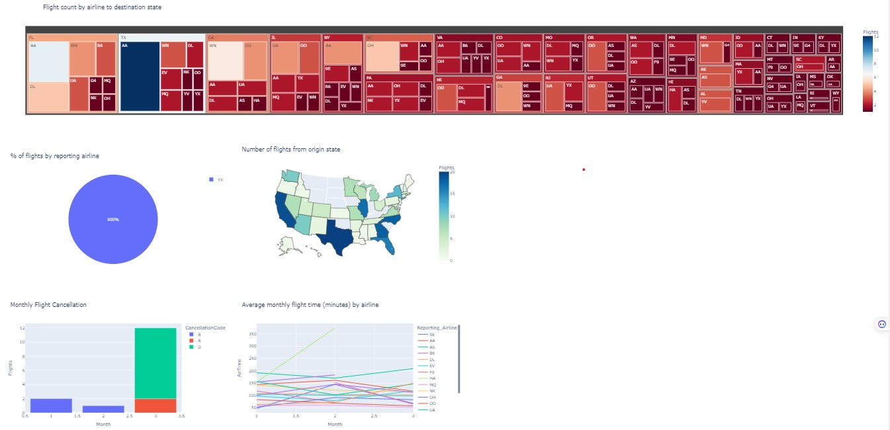
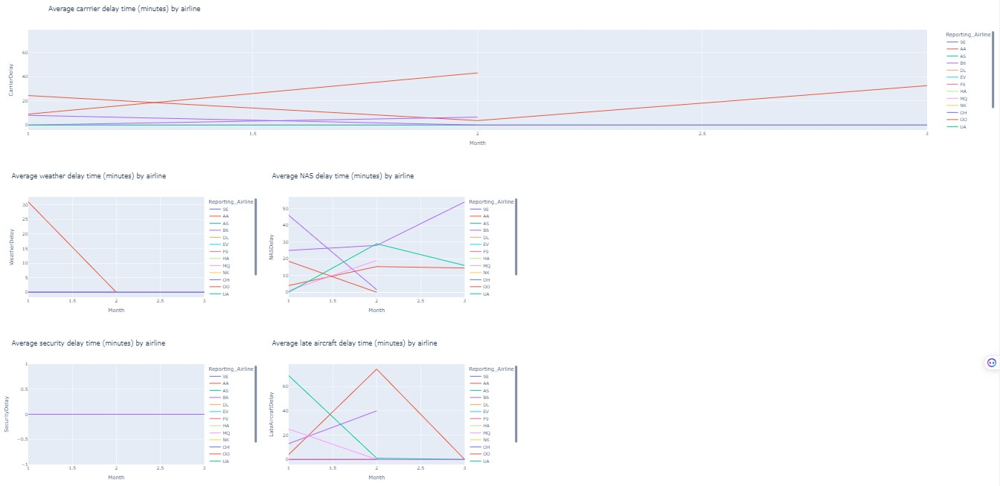

# Dash application
## A dash application to monitor and report US domestic airline flights performance

## Introduction
This is a dash application project to monitor and report US domestic flights performance for the year range between
2005 to 2020 inclusive. It's one of the projects that i did in the IBM Data Analyst Professional Certificate program.
The goal is to analyze the performance of the reporting airline to improve flight reliability thereby improving customer reliability.

The Report has two key items as shown below:
- Yearly airline performance report 
- Yearly average flight delay statistics

The yearly airline performance component consists of the following for each chosen year:
- A bar chart showing number of flights under different cancellation categories 
- A line chart showing average flight time by reporting airline 
- A pie chart showing percentage of diverted airport landings per reporting airline 
- A choropleth map showing number of flights flying from each state 
- A treemap showing number of flights flying to each state from each reporting airline

The yearly average flight delay statistics component consists of the following for each chosen year:
- Monthly average carrier delay by reporting airline
- Monthly average weather delay by reporting airline 
- Monthly average late aircraft delay by reporting airline for the given year.
- Monthly average security delay by reporting airline for the given year.
- Monthly average late aircraft delay by reporting airline for the given year.

##  Problem statement 
- Which airlines have the highest number of flights to destination states?
- Which  states have the highest number of flights  originating from there?
- what is the average monthly flight time in minutes by most airlines?
- what is the average carrier delay time in minutes for various airlines?
- what are the common causes of carrier delays?
- What is the average late aircraft delay time in minutes by airlines?

## Skills demonstrated.
- Python was used for coding the project together with some appropriate python libraries
- I used Visual Studio code to develop the application and launch it in the web browser.

## Data sourcing
The dataset used in this project was provided by the skills network labs. To download it click  <a href="https://cf-courses-data.s3.us.cloud-object-storage.appdomain.cloud/IBMDeveloperSkillsNetwork-DV0101EN-SkillsNetwork/Data%20Files/airline_data.csv">HERE</a>  
The sample dataset contains information about US domestic airlines.It includes information about the airlines and the 
states where these airlines conduct business together with other relevant information used in this project.
The airlines include:
| AIRLINE           | AIRLINE_CODE |  AIRLINE          | AIRLINE_CODE                   |
| ----------------- | -------      | ----------------- | -------------------------------|
| Alaska Airlines   | (AS)         | Frontier Airlines  | (F9)                          |
| Allegiant Air     | (G4)         | Hawaiian Airlines  | (HA)                          |
| American Airlines | (AA)         | JetBlue Airways    | (B6)                          |
| Delta Air Lines   | (DL)         | Southwest Airlines | (WN)                          |
| Sun Country Airlines| (SY)       | United Airlines    | (UA)                         |
| ViaAir            | (VC)         | Virgin America     | (VX)                          |
| Endeavor Air      | (9E)         | Envoy Air          | (MQ)                         |
| ExpressJet        | (EV)         | GoJet Airlines     | (G7)                          |
| Mesa Airlines     | (YV)         | Piedmont Airlines  | (PT)                         |
| PSA Airlines      | (OH)         | Republic Airways   | (YX)                         |
| SkyWest Airlines  | (OO)         | Southwest Airlines | (WN)                          |

The US states together with thier abbreviations used in the project are listed in the table below.
| STATE             | ABBREVIATION |  STATE             | ABBREVIATION               |
| ----------------- | -------      | -----------------  | ---------------------------|
| Alabama           | (AL)         | Alaska             | (AK)                        |
| Arizona           | (AZ)         | Arkansas           | (AR)                         |
| California        | (CA)         | Colorado            | (CO)                         |
| Connecticut       | (CT)         | Delaware           | (DE)                          |
| Florida           | (FL)         | Georgia            | (GA)                         |
| Hawaii            | (HI)         | Idaho              | (ID)                         |
| Illinois          | (IL)         | Indiana            | (IN)                         |
| Iowa              | (IA)          | Kansas            | (KS)                         |
| Kentucky          | (KY)         | Louisiana          | (LA)                         |
| Maine             | (ME)          | Massachusetts     | (MA)                          |
| Maryland          | (MD)         | Michigan           | (MI)                          |
| Minnesota         | (MN)         | Wyoming            | (WY)                          |
| Wisconsin         | (WI)         | West Virginia      | (WV)                         |
| Washington        | (WA)         | Virginia           | (VA)                           |
| Vermont           | (VT)         | Utah                | (UT)                          |
| Texas             | (TX)        | Tennessee            | (TN)                          |
| South Dakota      | (SD)        | South CarolinaX      | South Carolina(SC)            |
| Rhode Island      | (RI)         | Pennsylvania        | (PA)                          |
| Oregon            | (OR)         | Oklahoma            | (OK)                          |
| Ohio              | (OH)         | North Dakota        | (ND)                         |
| North Carolina    | (NC)        | New York             | (NY)                          |
| New Mexico        | (NM)         | New Jersey          | (NJ)                          |
| New Hampshire     | (NH)         | New Hampshire       | (NH)                          |
| Nevada            | (NV)          | Nebraska           | (NE)                          |
| Montana           | (MT)          | Missouri           | (MO)                          |
| Mississippi       | (MS)          |  Oklahoma          | (OK)                          |

## Data analysis and visualization
Graph showing 2005 flight performance
### key points from the graph above
- The top three Airlines that had highest number of flights to destination states were; Southwest Airlines (WN) which had 34 flights heading to california, followed by  American Airlines (AA) with 33 flights heading to Texas and then Delta Air Lines (DL) with 26 flights whose destination was Georgia (GA).
- Southwest Airlines (WN) had the highest percentage of flights reported of about 16.1%, followed by American Airlines (AA) with 9.64% of reported flights and then Envoy Air (MQ) with 9.05% of reported flights.
- We realise that the top five states which had the highest number of flights originating from there were California with 117 flights,Texas with 108 flights, Florida with 77 flights, Illinois (IL) with 73 flights and Georgia (GA) with 60 states
- Month 1 had the highest number of monthly flights with cancellation codes, A and B whereas month 4 and 5 did not have any flights with any cancellation code reported
- The top three airlines that had flights with the highest average monthly flight time are; JetBlue Airways (B6) with about 350 minutes of flight time followed by Hawaiian Airlines (HA) with a flight time of about 300 minutes and then Continental Airlines(CO) with flight time of about 250 minutes.

Graph showing 2005 airline carrier delay
### key points from the graph above
- SkyWest Airlines (OO) had the most average carrier delay of about 250 minutes in the seventh month
ExpressJet (EV), American Airlines (AA) and Northwest Airlines (NW) are the major airlines that experienced weather delays in minutes in certain months of the year.
- Alaska Airlines (AS) is the major airline that experienced a security delay in minutes reported of about 50 minutes in month 6.
- United Airlines (UA) experienced the most average late aircraft delay time of about 350 minutes in the third month 
- Airtran Airways(FL) experienced the second most average late aircraft delay time of about 200 minutes in month 3
- Average late aircraft delay by most airlines is about 50 minutes

Graph showing 2010 flight performance
### key points from the graph above
- The top four airlines which had the highest number of flights to destination states were American Airlines (AA) with about 35 flights to Texas, followed by SkyWest Airlines (OO) with about 26 flights to california(CA),
then Southwest Airlines (WN) which had 25 flights to california and tied with Delta Air Lines (DL) which
also had 25 flights to Georgia (GA).
- We can see that top 5 states that had the highest number of flights originating from there included Texas with 124 flights, followed by california with 96 flights followed by Georgia with 78 flights and Florida with 78 flights as well, followed by Illinois (IL) with 56 flights
- It can also be noted that month 2 and 12 experienced the most number of flights with various cancellation codes

Graph showing 2010 airline carrier delay
### key points from the graph above
- Most average carrier delay time experienced by airlines were about 50 minutes on average.
- Envoy Air (MQ),SkyWest Airlines (OO) and Delta Air Lines (DL) were the main airlines that experienced varying weather delays in minutes at different months
- Envoy Air (MQ) and Continental Airlines(CO) are the airlines that majorly also experienced NAS delay time in minutes.
- There were no flights that experienced dalays related to security matters that were reported.
- Airlines such as Endeavor Air(9E),Southwest Airlines (WN) and American Airlines (AA) are the airlines whose flights experienced the most average aircraft delays, with Endeavor Air(9E) experiencing the highest delays of upto 120 minutes followed by Southwest Airlines (WN) and then American Airlines (AA) with least delays.

Graph showing 2019 flight performance
### key points from the graph above
- The Top 3  airlines with the most number of flights  to destination states were Delta Air Lines (DL) with 50 flights to Georgia (GA),then followed Southwest Airlines (WN) with 39 flights to california and then American Airlines (AA) with 28 flights to Texas. 
- 50% of the flights reported were from American Airlines (AA), Delta Air Lines (DL),SkyWest Airlines (OO) and Allegiant Air (G4) shared a percentage of 16.7% of reported flights
- We can see that top 4 states that had the highest number of flights originating from there were California with 116 flights,followed by Texas with 96 flights,followed by Florida (FL) with 87 flights and then Illinois (IL)  which had 63 flights.
- Flight Cancellation codes were spread out to about 2 flights on average in every month.
- We can see a general monthly flight time of airlines to be about 150 minutes on average across various months

Graph showing 2019 airline carrier delay
### key points from the graph above
- Envoy Air (MQ) had the highest carrier delay of about 145 minutes in september and American SkyWest Airlines (OO) had a carrier delay of about 98 minutes in month 2
- Carrier delay by airlines is about 50 minutes on average
- Delays due to weather are about 25 minutes on average.
- Delays to due security are generally negligible among airlines on average.
- Late aircraft delays by airlines are about 50 minutes on average.

Graph showing 2020 flight performance
### key points from the graph above
- The top 3 airlines with the most number of flights  to destination states were American Airlines (AA) with 12 flights to Texas, followed by the same airline with 7 flights to florida,then Southwest Airlines (WN) with 6 flights to california.
- We can see that top 4 states that had the highest number of flights originating from there were Texas with 20 flights,followed by california with 19 flights,then followed by Georgia (GA) and North Carolina (NC) which tied with 18 flights.
- We can see an increase in a number of flights with cancellaton codes with Month 3 having the most cancellation codes for a number of flights.
- Hawaiian Airlines (HA) had the highest average monthly flight time in minutes of about 350 minutes in month 2 whereas other airlines had an average of about 150 monthly flight time in minutes

Graph showing 2020 airline carrier delay
### key points from the graph above
- SkyWest Airlines (OO) had the most carrier delay of about 40 minutes in month 2 and American Airlines (AA) had a delay of about 25 minutes in month 3
- Alaska Airlines (AS)  generally had no delays reported whereas Southwest Airlines (WN) had a carrier delay of
about 10 minutes 
- American Airlines (AA) experienced a  maximum weather delays of about 30 minutes.
- Delays due to security for reporting airline have been negligible.
- United Airlines (UA) has the most average late aircraft delay time of about 65 minutes in month 1 and reduced to 0 in month 2
- American Airlines (AA) had the most  average late aircraft delay time of about 70 minutes in month 2 and it reduced to 0 in month 3

## Conclussion
- The top 3 airlines on average that have been so competitive in the period of 2005 to 2020 with highest number of flights to destination states have been American Airlines (AA), Southwest Airlines (WN), and  Delta Air Lines (DL)
- The top 5 states on average that have had the highest number of flights originating from there in 2005 to 2020 are 
  Texas, California,Georgia,Florida and Illinois
- Different Airlines are affected by different delays in different months in general.
- There was a drastic decrease in both state destination flights and number of flights from various origins by state  in 2020 and this is attributed to the fact that 2020 was the year when airline businesses were greatly affected by covid-19 and a number of flights were cancelled.

